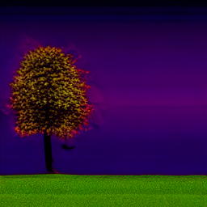

# Genetic Tree Project

This project implements a pipeline for encoding human SNP (single nucleotide polymorphism) data into fixed-length embeddings, evaluating their structural validity via clustering and classification, and visualizing the genetic embeddings via generative image synthesis using a latent diffusion model.

---

## Requirements and installation

Required environment can be created with the help of "requirements.txt".
Image generation is done via latent diffusion model pipeline (Rombach et al., 2021). Download here:  https://github.com/CompVis/latent-diffusion/blob/main/README.md

---

## Repository Structure

```
root/
├── pipeline_embeddings.py     # Run full SNP-to-embedding pipeline
├── pipeline_distances.py      # Compare genetic/image/embedding distances
├── pipeline_classifier.py     # Train case-control classifier on embeddings
├── config.py                  # Central config with paths and constants for all pipelines
├── lookup_subID.py            # Helpful to get the internal subject ID for the image generation from the FemNat_IDs
├── embeddings/                # Scripts for preprocessing and SNP vector generation
├── distances/                 # All scripts for distance metrics + analysis
├── classifier/                # Scripts for label creation and XGBoost classifier
```

---

## Step-by-Step Usage

### 1. Prepare Embeddings

```bash
python pipeline_embeddings.py
```
This runs:

| Step | Script                                         | Description                                  | Input            | Output                              |
| ---- | ---------------------------------------------- | ---------------------------------------------| ---------------- | -----------------------             |
| 1    | `embeddings/preprocessing.py`                  | Preprocess SNP data via PLINK, export `.raw` | `.bed/.bim/.fam` | `Final_Imputed_raw.raw`             |
| 2    | `embeddings/prep_embeddings.py`                | Convert SNPs to binary vector format         | `.raw`           | `snp_vectors.npy`                   |
| 3    | `embeddings/reshape_snp_vectors_similarity.py` | Build similarity-based embeddings            | vector           | `snp_similarity_vectors.npy`        |
| 4    | `embeddings/z_transformation.py`               | Z-score normalization                        | similarity vecs  | `snp_similarity_zscore_vectors.npy` |
| 5    | `embeddings/prep_ldm.py`                       | Prepare latent input for LDM image model     | z-score vecs     | `latents_batch_similarity.pt`                    |

When asked which method for creating embeddings should be used, select 2 = Similarity Scores
(1 = PCA remains under construction)

---

### 2. Generate Images with txt2img

Use the resulting embeddings as conditioning for latent diffusion-based image synthesis.

For this, a latent diffusion model by Rombach et al.(2021) was used, which can be downloaded here: https://github.com/CompVis/latent-diffusion/blob/main/README.md

To run the snp-embedding based image generation, run this command on the provided modified version of txt2img.py:

```bash
for i in {xx}; do
   echo "Generating image for subject $i...";
   python scripts/txt2img.py    
     --init_latents /files/data/ldm_dataset/latents_batch_similarity.pt
     --subject_idx $i
     --n_samples 1; done
```

This will generate `subject_XXX_sample_XXXX.png` files for each SNP embedding.
The default prompt is set to "tree on grass".

Example images:




---

### 3. Compare Genetic, Embedding & Image Distances

```bash
python pipeline_distances.py
```
| Step | Script                               | Description                                                                 | Input                                        | Output                                       |
|------|--------------------------------------|-----------------------------------------------------------------------------|----------------------------------------------|----------------------------------------------|
| 1    | `distances/genetic_distances.py`     | Computes genetic distances using PLINK (`PI_HAT` metric)                    | PLINK `.bed/.bim/.fam` files                 | `genetic_distances.npy`                      |
| 2    | `distances/embedding_distances.py`   | Computes distances between SNP embeddings (Euclidean and Correlation)       | embeddings (config.ZSCORE_VECTOR_NPY)        | `embedding_euclidean_distances.npy`, `embedding_correlation_distances.npy` |
| 3    | `distances/images_distances.py`      | Computes distances between generated images (SSIM, RGB hist, CHI2, cosine)  | PNG images from LDM                          | `image_ssim_distances.npy`, `image_hist_distances.npy`, `image_cv_hist_chisqr.npy`, `image_dense_cosine.npy` |
| 4    | `distances/compare_distances.py`     | Correlates distances (Spearman), compares cluster agreement, visualizes     | All distance `.npy` files + sample IDs       | Scatterplots, Sankey charts                  |

This script creates genetic/image/embedding distance matrices and computes:

* Pairwise Spearman correlations
* Agglomerative clustering and ARI/NMI agreement
* Scatterplots and sankey charts for visual comparison

**Output includes:**

* `distance_plots/genetic_vs_all_distances.png`
* `distance_plots/genetic_vs_all_distances_HIGHGEN.png` (only for subjects with larger genetic distance, not siblings)
* `distance_plots/sankey_grid.png`

** Extra script: compare_siblings_vs_unrelated.py **

The script directly compares top 20 genetically most similar and dissimilar pairs distances across metrics via Mann-Whitney U-test and Rank-Biserial correlation for effect size.

---

### 4. Classifier Evaluation

```bash
python pipeline_classifier.py
```

This runs:

| Step | Script                                | Description                          | Input                    | Output                         |
| ---- | ------------------------------------- | ------------------------------------ | -------------------------| ------------------------------ |
| 1    | `classifier/matchIDs_case_control.py` | Match phenotype group to subject IDs | CSV + Excel              | `ID_LifeAndBrain_to_Group.csv` |
| 2    | `classifier/case_control_labels.py`   | Map subject indices to group labels  | CSV with matched IDs     | `case_control_labels.csv`      |
| 3    | `classifier/xgb_classifier.py`        | Train and evaluate 5-fold XGBoost    | z-score vectors + labels | Classification + ROC plots     |

The CSV and Excel files should contain partno, centre, group to get ID_LifeAndBrain and another matching ID_LifeAndBrain and ID_FemNAT.
The classification task serves as a proof-of-concept that the embeddings still contain relevant information to classify e.g. cases and controls in a sample.

**Output:**

* `embedding_plots/figure_fold_scores.png`
* `embedding_plots/figure_roc_curves.png`

---

## Summary

This pipeline allows you to:

* Compress SNPs to meaningful embeddings
* Generate individual "genetic tree" images based on genetic embeddings
* Evaluate structural fidelity with correlation and cluster agreement
* Proof-of-concept with classification task

---

## Contact

For questions, contact: **Antonia Ceric** (s4414314@stud.uni-frankfurt.de, antonia.ceric@gmail.com)

---

## References

Rombach, R., Blattmann, A., Lorenz, D., Esser, P. & Ommer, B. (2021). High-Resolution Image Synthesis with Latent Diffusion Models. arXiv (Cornell University). https://doi.org/10.48550/arxiv.2112.10752
